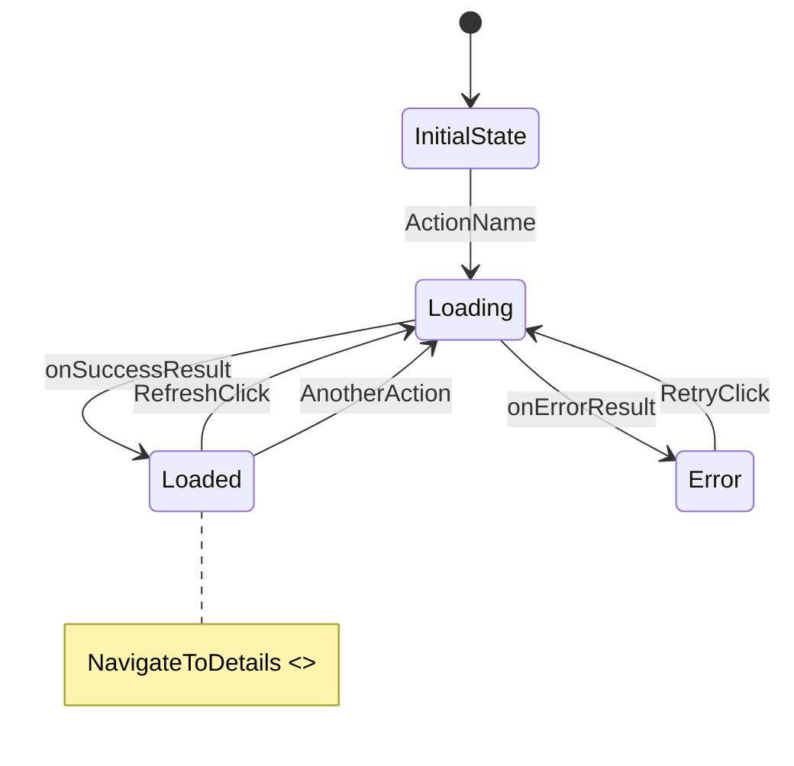

# State Machine Visualizer

## Step 1 — Find and read files

Given the feature name or ViewModel path, find and read in parallel:

- `*ViewModel.kt` — `dispatch()` and all `onXxx()` handlers
- `*Action.kt` — all actions (sealed interface members)
- `*UiState.kt` / `*State.kt` — all possible states
- `*Event.kt` — one-off side effects (navigation, toasts)

## Step 2 — Trace transitions

For every `onXxx()` handler in the ViewModel, determine:

- **Source state(s):** from which state(s) can this action be dispatched?
  (If no guard, assume any state. If there's a state check, note the guard.)
- **Intermediate state:** does it first set `Loading`?
- **Target state(s):** what state does success/error result in?
- **Events:** does it emit an Event instead of changing state? (side effect)

## Step 3 — Generate Mermaid diagram

Rules:

- Use the exact class names from the code (e.g., `HomeUiState.Loaded` → `Loaded`)
- Label transitions with the **Action** name that triggers them
- Label result transitions with the handler method name (`onFetchSuccess`, `onFetchError`)
- Events (Channel emissions) go in a `note` block — they don't change state
- If an action is only valid from specific states, add a guard:
  `Loaded --> Loading : RefreshClick [from Loaded]`

## Step 4 — Transition table

After the diagram, output a compact table:

| Action                    | From      | To        | Side Effect               |
|---------------------------|-----------|-----------|---------------------------|
| `RefreshClick`            | any       | `Loading` | —                         |
| `ItemSelect`              | `Loaded`  | `Loaded`  | `NavigateToDetails` event |
| *(result)* onFetchSuccess | `Loading` | `Loaded`  | —                         |
| *(result)* onFetchError   | `Loading` | `Error`   | —                         |
