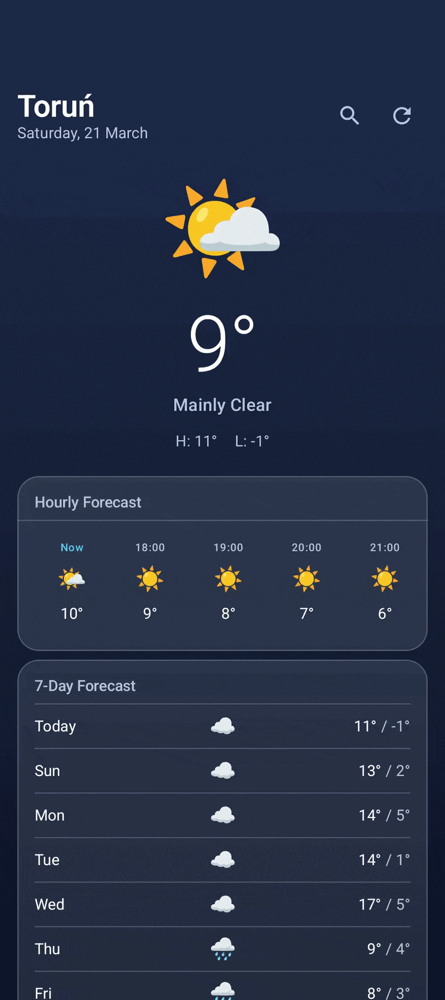
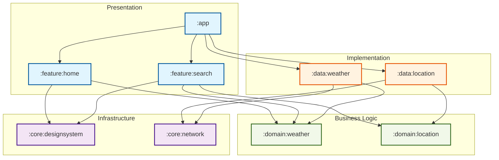

# 🌤️ WeatherVibe

<div align="center">

[](http://kotlinlang.org)
[](https://developer.android.com/jetpack/compose)
[](#)
[](#)

**A beautifully crafted, highly modular Android weather application.** *Built to demonstrate strict architectural discipline and the power of AI-assisted development.*

  <br />

  

</div>

## 📋 Table of Contents
* [About The Project](#-about-the-project)
* [The Vibe Flow (AI Collaboration)](#-the-vibe-flow-ai-collaboration)
* [Architecture & Tech Stack](#-architecture--tech-stack)
* [The Architectural Constitution](#-the-architectural-constitution-ai-rules)
* [Getting Started](#-getting-started)

---

## 📖 About The Project

**WeatherVibe** is more than just another weather app. It's an experimental playground exploring
how **"Vibe Coding"** (human-AI pair programming) can produce enterprise-grade, scalable software
when constrained by unbreakable architectural rules.

### ✨ Key Features
* **Real-time Weather Data:** Accurate forecasting powered by Open-Meteo API.
* **Token-Based Design System:** A completely custom, resource-injected UI layer.
* **Offline Support:** Robust local caching using Room database with relational mapping.
* **Fluid Animations:** Smooth transitions and micro-interactions.

---

## 🌊 The Vibe Flow (AI Collaboration)

This project isn't just "generated" by AI; it's **architected by humans and executed by AI**. We
follow a strict cycle to ensure zero technical debt:

1.  **Contextual Prompting:** The Developer defines the intent (e.g., "Add a new weather metric").
2.  **Rule Enforcement:** The AI agent is forced to read our `docs/ai-rules/` before proposing code.
3.  **Step-by-Step Thinking:** AI explains its plan and lists intended file changes.
4.  **Human Verification:** The Developer reviews the "Vibe" and architectural alignment.
5.  **Self-Correction:** AI runs through a checklist (Self-Verification) to ensure no rules were broken.

---

## 🏗️ Architecture & Tech Stack

This project is a love letter to **Clean Architecture** and **Unidirectional Data Flow (UDF)**.

### The Stack
* **UI:** Jetpack Compose (Strict Stateless/Stateful separation)
* **Architecture:** MVI (Model-View-Intent) with strictly **Passive ViewModels**.
* **Network:** Ktor Client + `kotlinx.serialization`.
* **Local Storage:** Room Database (Relational schemas).
* **Dependency Injection:** Koin (using KSP Annotations).

### Module Dependency Graph


---

## 🧱 The Architectural Constitution (AI Rules)

Every AI interaction is governed by these "unbreakable" laws. These files act as the 
**System Prompt Extension** for any AI agent working on this repo.

| Rule File | Core Responsibility | Key "Unbreakable" Laws |
| :--- | :--- | :--- |
| 🏗️ [Architecture](docs/ai-rules/architecture.md) | Logic & State | **Passive ViewModels** & Result-driven Clean Architecture. |
| 🎨 [Compose UI](docs/ai-rules/compose-ui.md) | Presentation | **Token-based Design System** with Atomic Components. |
| 💅 [Code Style](docs/ai-rules/code-style.md) | Hygiene | **Strict Formatting** & Mandatory Named Arguments. |
| 🌐 [Network](docs/ai-rules/network-ktor.md) | External API | **Strict Data Boundaries** & Ktor Implementation. |
| 💾 [Database](docs/ai-rules/database-room.md) | Persistence | **Relational Mapping** over flat JSON persistence. |
| 📦 [Modularization](docs/ai-rules/modularization.md) | Structure | **Namespace-driven** layered feature modules. |

---

## 🚀 Getting Started

1. Clone the repository:
   ```bash
   git clone https://github.com/azalewski/WeatherVibe.git
   ```
2. Open in **Android Studio Ladybug** (or newer).
3. Build and run:
   ```bash
   ./gradlew assembleDebug
   ```

---

<div align="center">
  <b>Crafted with ❤️ and 🤖</b>
  <br/>
  <i>Feel free to use this architecture as inspiration for your own projects!</i>
</div>
